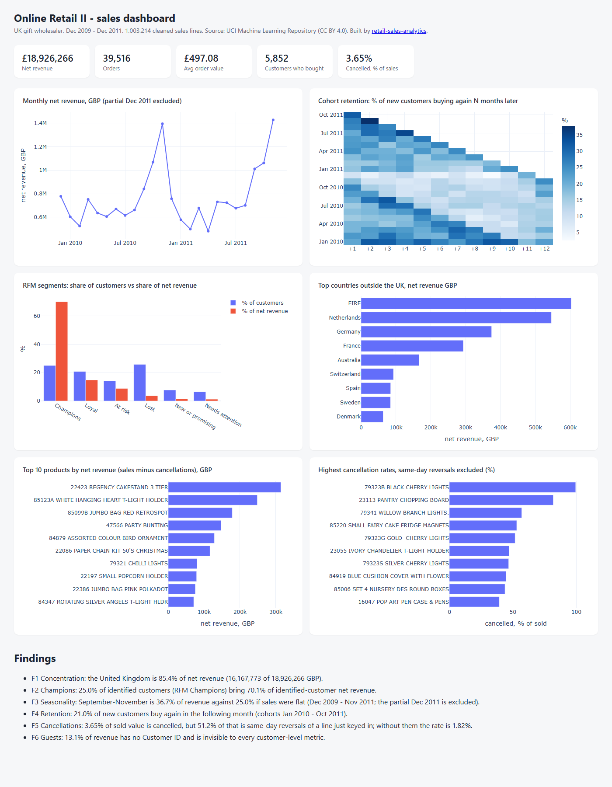
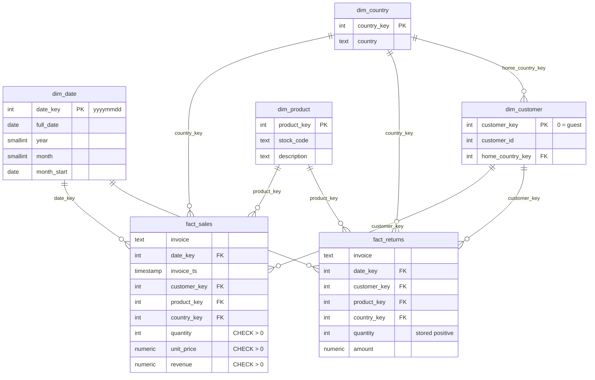

# retail-sales-analytics

SQL + Python ETL + dashboard on two years of real transactions from a UK online gift
wholesaler (UCI Online Retail II, 1,067,371 invoice lines, Dec 2009 - Dec 2011).
Raw Excel goes into a PostgreSQL star schema, every cleaning rule is counted, six SQL
files answer six business questions, and a static dashboard shows the result.



**Live dashboard: <https://dkautomation23.github.io/retail-sales-analytics/>** - a static
page built from [`docs/index.html`](docs/index.html), no server behind it.

## Findings

Printed by `python -m analytics.findings` straight from the warehouse - no number below
is typed by hand, and `check.py` fails if this block drifts from the command output.

<!-- findings:start -->
```
F1 Concentration: the United Kingdom is 85.4% of net revenue (16,167,773 of 18,926,266 GBP).
F2 Champions: 25.0% of identified customers (RFM Champions) bring 70.1% of identified-customer net revenue.
F3 Seasonality: September-November is 36.7% of revenue against 25.0% if sales were flat (Dec 2009 - Nov 2011; the partial Dec 2011 is excluded).
F4 Retention: 21.0% of new customers buy again in the following month (cohorts Jan 2010 - Oct 2011).
F5 Cancellations: 3.65% of sold value is cancelled, but 51.2% of that is same-day reversals of a line just keyed in; without them the rate is 1.82%.
F6 Guests: 13.1% of revenue has no Customer ID and is invisible to every customer-level metric.
F7 Baskets: customers buy collections - the 75 strongest product pairs are all pieces of one collection (top: Herb Marker Parsley + Herb Marker Chives, lift 147.2); the strongest pair across collections is Boys Vintage Tin Seaside Bucket + Red Metal Beach Spade, bought together 44.7x more often than chance (262 orders).
F8 Retention value: each +1 pp of month-1 retention is worth about 46,873 GBP of net revenue a year (an estimate: 213 new customers a month; in the next 12 months a month-1 returner brings 2,520 GBP, other new customers 684 GBP).
F9 Seasonal customers: 24.5% of customers first seen in September-November buy again the next month, against 19.6% of those first seen in other months (difference +4.9 pp, 95% interval +2.2 to +7.6 pp, p < 0.001; 1,349 and 3,333 customers). The difference is unlikely to be chance.
```
<!-- findings:end -->

What they mean for the business:

- **F1, F2** - revenue depends on one country and on a quarter of the identified
  customers (1,463 Champions). Each of them is worth far more than an average customer,
  so churn among them is the first thing to monitor.
- **F3** - stock and staffing have to be in place by August; a flat plan under-delivers
  exactly in the three months that make over a third of the year.
- **F4, F8** - 79% of new customers do not buy again the following month. The second
  order is where the funnel leaks most, and F8 puts a ceiling on what fixing it is worth;
  it is the first place to test an intervention.
- **F9** - customers acquired in the autumn peak come back more often than the rest, by more
  than chance (two-proportion test, interval in the line above). Observational: it says
  nothing about why, and it does not make the autumn customers worth more.
- **F5** - half of the "cancellations" are lines reversed on the day they were keyed in,
  including two bulk orders of 74,215 and 80,995 units. That is an order-entry problem,
  not a product-quality one, and it doubles the apparent cancellation rate.
- **F6** - any "revenue per customer" number from this data is computed on 87% of revenue.
- **F7** - customers complete collections, so bundles and "complete the set" suggestions
  follow the data; the cross-collection pairs (bucket and spade, board games) are the
  candidates for cross-sell placement.

## Recommendations

Three actions, each tied to a finding. Generated by the same command as the findings,
so the numbers below come from the data, and `check.py` fails if they drift.

<!-- recommendations:start -->
1. **Win the second order.** Only 21.0% of new customers buy again the next month (F4). Test a first-month follow-up offer on half of new customers; each +1 pp it adds is worth up to 46,873 GBP a year (F8), which is the budget ceiling for the test. Size it first: at 213 new customers a month, a 50/50 split can only detect a lift of 6.7 pp after 6 months (4.7 pp after 12; 80% power, 5% significance), so a +1 pp effect would be invisible and the offer must aim higher.
2. **Confirm large orders before they are booked.** 51.2% of cancelled value is lines reversed the same day (F5), and the two largest cancelled orders alone are 34.3% of it. A confirmation step for unusually large quantities would have caught both, and keeps phantom orders out of the sales and stock reports.
3. **Sell collections as sets.** The 75 strongest product pairs are pieces of one collection (F7): offer bundles and a "complete the set" prompt on the product page. Put cross-collection pairs such as Boys Vintage Tin Seaside Bucket + Red Metal Beach Spade (lift 44.7) next to each other in the catalogue.
<!-- recommendations:end -->

## Run it

Requirements: Docker, Python 3.12+.

```bash
python -m venv .venv && .venv/Scripts/activate   # macOS/Linux: source .venv/bin/activate
pip install -r requirements.txt
python scripts/run_all.py
```

`run_all.py` starts PostgreSQL 16 (`docker compose`, port 5433), downloads the dataset
and checks its pinned sha256, loads the star schema, runs the data-quality checks and
the tests, prints the findings and writes `docs/index.html`. The first run takes a few
minutes, most of it reading the Excel file once; later runs read a CSV cache.

Single steps:

| Command | Does |
|---|---|
| `python -m analytics.etl` | clean + load the warehouse, print the cleaning table |
| `python -m analytics.queries` | run every file in `sql/analysis/` |
| `python -m analytics.quality` | 9 data-quality checks, exit code 1 on any failure |
| `python -m analytics.findings` | the findings above (`--write-readme` refreshes this README) |
| `python -m analytics.impact` | the retention-value estimate behind F8, step by step |
| `python -m analytics.dashboard` | rebuild `docs/index.html` |
| `python -m analytics.export_bi` | export the star schema to `bi/data/*.csv` |
| `python -m analytics.export_excel` | write `bi/retail-sales-summary.xlsx`: monthly revenue with live formulas |
| `python check.py` | release gate: tests, dbt, README numbers vs data, dashboard freshness, secret and privacy scans |

## Data model



Grain of `fact_sales`: one invoice line that is a real product sale. Cancellation invoices
(`C...` in the source) live in `fact_returns` with the same keys, so revenue never mixes
with negative quantities and cancellation rates are a simple ratio. `dim_date` is a
continuous calendar (every day from the first to the last invoice), which BI tools need
for time intelligence. DDL: [`sql/schema.sql`](sql/schema.sql).

Loaded rows:

| Table | Rows |
|---|---:|
| fact_sales | 1,003,214 |
| fact_returns | 17,914 |
| dim_customer | 5,876 |
| dim_product | 4,892 |
| dim_date | 739 |
| dim_country | 43 |

## Cleaning

Applied in this order; `python -m analytics.etl` prints this table on every load.

| Rule | Before | After | Removed |
|---|---:|---:|---:|
| exact duplicate lines | 1,067,371 | 1,033,036 | 34,335 |
| cancellations moved to fact_returns | 1,033,036 | 1,013,932 | 19,104 |
| non-product stock codes (postage, fees, adjustments) | 1,013,932 | 1,009,142 | 4,790 |
| quantity zero or negative | 1,009,142 | 1,005,780 | 3,362 |
| unit price zero or negative | 1,005,780 | 1,003,214 | 2,566 |

226,637 lines without a Customer ID are **kept** as guest sales (`customer_key 0`):
dropping them would delete 13% of revenue from every total. Customer-level metrics
(RFM, cohorts) exclude them explicitly.

## Analysis

Each file in [`sql/analysis/`](sql/analysis) answers one question:

| File | Question |
|---|---|
| `01_monthly_revenue.sql` | Revenue, cancellations, net revenue, orders, customers and AOV by month; month-over-month growth |
| `02_cohort_retention.sql` | Of the customers who first bought in month M, what share bought again N months later? |
| `03_rfm_segments.sql` | RFM scores (`ntile` quintiles on net value) -> six segments with their share of customers and net revenue |
| `04_top_products_countries.sql` | Top products and countries by **net** revenue (sales minus cancellations) |
| `05_return_rate.sql` | Cancellation rate overall, with and without same-day reversals, and the products with the highest rate |
| `06_basket_pairs.sql` | Which products are bought in the same order? Support, confidence and lift for every pair in 0.5%+ of orders |

## dbt

[`dbt/`](dbt) rebuilds the reporting layer the way an analytics team would maintain it:
`sources` (the star schema) -> `staging` views (`stg_sales`, `stg_cancellations`,
`stg_products`, `stg_countries`) -> `marts` tables (`mart_monthly_revenue`,
`mart_customer_rfm`). 33 dbt nodes run under `dbt build`: models, `unique` / `not_null` on
every key, `relationships` from facts to dimensions, `accepted_values` on RFM segments,
and a reconciliation test that the marts carry exactly the money in the facts. That test
failed on its first run: 23 customers appear only in cancellations (their purchases
predate the data), 1,406.13 GBP that the RFM mart rightly leaves out. It is now
reconciled explicitly instead of hidden in a tolerance. A pytest check asserts the dbt
RFM mart and `sql/analysis/03_rfm_segments.sql` give identical segments.

```bash
cd dbt && dbt build --profiles-dir .
```

## Tests and quality checks

- `analytics/quality.py` - 10 SQL checks: no cancellations in sales, no non-positive
  revenue, revenue equals quantity x price, no orphan date / product / customer keys, no
  empty product descriptions, no non-positive cancelled quantities, no gaps in the
  calendar, no duplicate customer ids. Exit code 1 if any fails.
- `tests/` - 35 pytest tests. Unit tests for every cleaning rule on a small synthetic
  frame, and warehouse tests. One test copies the schema, breaks the data on purpose and
  asserts that **every** quality check fails on it, so a check that silently always
  passes is caught.
- CI (`.github/workflows/ci.yml`) runs the whole pipeline on every push: download and
  sha256 check, load into a PostgreSQL 16 service, quality checks, `dbt build`, all tests, findings,
  and the dashboard as a build artifact. Actions are pinned to commit SHAs.

## Power BI

The star schema is also modelled for Power BI Desktop, as a **Power BI Project**: plain text
files that diff in git, not a binary `.pbix`.

- [`bi/retail-sales.pbip`](bi/retail-sales.pbip) opens the project. The semantic model
  (`retail-sales.SemanticModel`, TMDL) has the six warehouse tables, 8 many-to-one
  relationships, `dim_date` marked as the date table and 11 DAX measures. The report
  (`retail-sales.Report`, PBIR) has one page: five KPI cards, monthly revenue, net revenue by
  country and by product, year and country slicers.
- [`bi/measures.md`](bi/measures.md) is the source of the measures, with a table of expected
  values computed in SQL. `check.py` fails if the measures in the project differ from it, or
  if a table in the model has different columns from the warehouse.
- [`bi/POWERBI.md`](bi/POWERBI.md) is the manual route (about 30-40 minutes) if you prefer to
  build the model by hand, from PostgreSQL or from `python -m analytics.export_bi` CSV files.

To open: start the database (`docker compose up -d db`), open `bi/retail-sales.pbip`, enter
the database credentials when asked (user `retail`, password `retail`, the local demo
container), then *Refresh*. The server and database names are parameters (`PgServer`,
`PgDatabase`). The project holds no data and no credentials.

## Excel

[`bi/retail-sales-summary.xlsx`](bi/retail-sales-summary.xlsx) (9 KB) is a monthly summary for people who do not open a database. Gross revenue, cancelled value and orders per month are values from the warehouse; net revenue, month on month and year on year change, the yearly table, the best month and a check cell against the warehouse total (`Summary!B3`, must read 0) are Excel formulas. It was recalculated in Excel: the check cell reads 0, and changing one month moves it away from 0. `check.py` compares its monthly values with the warehouse.

What has been verified: every JSON file validates against Microsoft's published schemas, and
the TMDL folder loads with Microsoft's own `TmdlSerializer`. What has not: the report has
not been opened and rendered in Power BI Desktop yet, so the visuals' layout is untested.

## What broke

Real problems from building this, not hypothetical ones:

1. **A cancelled order ranked as the #4 best-selling product.** "PAPER CRAFT, LITTLE
   BIRDIE" showed 168,469.60 GBP of gross revenue - all from order 581483, 80,995 units,
   cancelled in full the same day by C581484. Fix: rank by net revenue, with cancellations
   in their own fact table. A test now asserts this product is not in the top 10.
2. **Reading the Excel file took about 1.5 minutes per run** (two sheets, 1,067,371 rows).
   Fix: the ETL writes a CSV cache after the first read.
3. **The monthly chart rendered wider than its card and cut off all of 2011.** Plotly
   measured the width before the CSS grid had laid out. Fix: `min-width: 0` on the card
   and `Plotly.Plots.resize` after the page loads.
4. **Docker Desktop was not running at the start**, so `docker compose` could not start
   the database. `run_all.py` now uses `--wait` so it fails at the first step with a clear
   message instead of later with a connection error.
5. **A review of the first version caught three analysis errors**, all fixed before
   publishing:
   - Retention was 23.0%, inflated by the first month of data: "new customers" in
     Dec 2009 were everyone already buying. Excluding that cohort and the partial
     Dec 2011 gives 21.0%.
   - RFM scored gross value, so one customer's 168k order, cancelled the same day, made
     up 43% of the "New or promising" segment. Monetary is now net of cancellations.
   - `ntile` split customers with equal frequency into different quintiles in an
     arbitrary order, so a reload could change the Champions share. `customer_key` now
     breaks ties.
6. **The date dimension had gaps** (604 trading days out of 739), so Power BI could not
   mark it as a date table. It is now a continuous calendar, and a quality check fails on
   any gap.

## Honest limits

- One company, two years, one dataset. The findings describe this wholesaler, not
  e-commerce in general.
- Revenue is `quantity x unit_price` from the invoice; there are no costs, so nothing
  here says anything about margin.
- 13.1% of revenue has no Customer ID. RFM, cohorts and retention are computed on the
  identified 86.9% only.
- A customer's home country is the most frequent country on their invoices; 12
  identified customers ordered from more than one country. Country revenue uses the
  invoice country, so it is not affected.
- The data ends on 9 December 2011 (8 trading days of that month). December 2011 is
  excluded from the monthly chart and the seasonality finding, but included in all-time
  totals.
- The source does not tell a customer return from an order cancellation; both are
  `C...` invoices. They are called cancellations here.
- A cancellation is not linked to the invoice line it cancels (the source has no such
  link). "Same-day reversal" is inferred: a cancellation line that matches a sale line
  exactly (customer, product, quantity, amount, day). Rates are cancelled value / sold
  value over the whole period, not per order.
- F8 is an estimate, not a forecast. Customers who come back in month 1 are partly
  different customers (bigger buyers), not just the same customers nudged; a campaign
  that wins back an extra 1% will likely win back people worth less than today's
  returners. Read F8 as an upper bound on what a second-order campaign can be worth.
- "One collection" in F7 is inferred from a shared word in the product names (the source
  has no category). It splits the chart; it is not a product hierarchy.
- F9 and the test sizing in the first recommendation use normal approximations
  (`analytics/stats.py`, standard library only), which are fine for the group sizes here.
  They compare groups of customers as they happened; they do not prove that a campaign works.
- RFM quintiles are relative: a Champion is in the top 40% on recency and frequency of
  this customer base, not above a fixed threshold.
- The dashboard is a static snapshot; rebuild it with `python -m analytics.dashboard`.

## Data and license

Data: Chen, D. (2012). *Online Retail II* [Dataset]. UCI Machine Learning Repository,
<https://doi.org/10.24432/C5CG6D>, licensed under
[CC BY 4.0](https://creativecommons.org/licenses/by/4.0/). Not redistributed here;
`scripts/download_data.py` fetches it and verifies its sha256.

Code: MIT, see [LICENSE](LICENSE).
