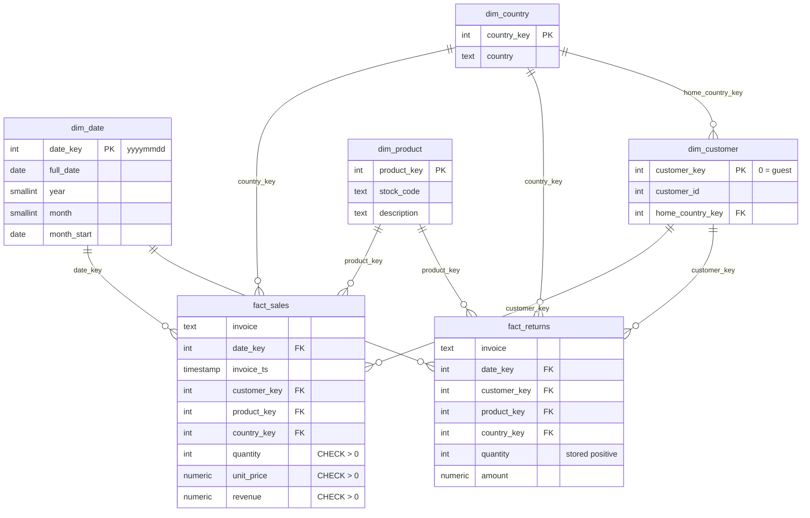

# retail-sales-analytics

SQL + Python ETL + dashboard on two years of real transactions from a UK online gift
wholesaler (UCI Online Retail II, 1,067,371 invoice lines, Dec 2009 - Dec 2011).
Raw Excel goes into a PostgreSQL star schema, every cleaning rule is counted, five SQL
files answer five business questions, and a static dashboard shows the result.


Live page: `docs/index.html` (static, opens without a server; ready for GitHub Pages).

## Findings

Printed by `python -m analytics.findings` straight from the warehouse - no number below
is typed by hand, and `check.py` fails if this block drifts from the command output.

<!-- findings:start -->
```
F1 Concentration: the United Kingdom is 85.4% of net revenue (16,167,773 of 18,926,266 GBP).
F2 Champions: 25.1% of identified customers (RFM Champions) bring 69.1% of identified-customer revenue.
F3 Seasonality: September-November is 36.7% of revenue against 25.0% if sales were flat (Dec 2009 - Nov 2011; the partial Dec 2011 is excluded).
F4 Retention: 23.0% of new customers buy again in the following month.
F5 Returns: 3.65% of sold value is returned; the two largest cancelled orders alone are 34.3% of it.
F6 Guests: 13.1% of revenue has no Customer ID and is invisible to every customer-level metric.
```
<!-- findings:end -->

What they mean for the business:

- **F1, F2** - revenue depends on one country and on a quarter of the customer base.
  Losing a handful of Champions costs more than any marketing channel brings in; they
  deserve account management, not newsletters.
- **F3** - stock and staffing have to be in place by August; a flat plan under-delivers
  exactly in the three months that make over a third of the year.
- **F4** - 77% of new customers do not buy again the following month. The first repeat
  order is the cheapest growth lever in the data.
- **F5** - the return rate looks healthy, but a third of it is two orders. Large orders
  need a confirmation step, not a general returns policy.
- **F6** - any "revenue per customer" number from this data is computed on 87% of revenue.

## Run it

Requirements: Docker, Python 3.12+.

```bash
python -m venv .venv && .venv/Scripts/activate   # macOS/Linux: source .venv/bin/activate
pip install -r requirements.txt
python scripts/run_all.py
```

`run_all.py` starts PostgreSQL 16 (`docker compose`, port 5433), downloads the dataset
and checks its pinned sha256, loads the star schema, runs the data-quality checks and
the tests, prints the findings and writes `docs/index.html`. The first run takes a few
minutes, most of it reading the Excel file once; later runs read a CSV cache.

Single steps:

| Command | Does |
|---|---|
| `python -m analytics.etl` | clean + load the warehouse, print the cleaning table |
| `python -m analytics.queries` | run every file in `sql/analysis/` |
| `python -m analytics.quality` | 9 data-quality checks, exit code 1 on any failure |
| `python -m analytics.findings` | the findings above |
| `python -m analytics.dashboard` | rebuild `docs/index.html` |
| `python -m analytics.export_bi` | export the star schema to `bi/data/*.csv` |
| `python check.py` | everything above plus repository hygiene checks |

## Data model



Grain of `fact_sales`: one invoice line that is a real product sale. Cancellations live in
`fact_returns` with the same keys, so revenue never mixes with negative quantities and
return rates are a simple ratio. DDL: [`sql/schema.sql`](sql/schema.sql).

Loaded rows:

| Table | Rows |
|---|---:|
| fact_sales | 1,003,214 |
| fact_returns | 17,914 |
| dim_customer | 5,876 |
| dim_product | 4,892 |
| dim_date | 604 |
| dim_country | 43 |

## Cleaning

Applied in this order; `python -m analytics.etl` prints this table on every load.

| Rule | Before | After | Removed |
|---|---:|---:|---:|
| exact duplicate lines | 1,067,371 | 1,033,036 | 34,335 |
| cancellations moved to fact_returns | 1,033,036 | 1,013,932 | 19,104 |
| non-product stock codes (postage, fees, adjustments) | 1,013,932 | 1,009,142 | 4,790 |
| quantity zero or negative | 1,009,142 | 1,005,780 | 3,362 |
| unit price zero or negative | 1,005,780 | 1,003,214 | 2,566 |

226,637 lines without a Customer ID are **kept** as guest sales (`customer_key 0`):
dropping them would delete 13% of revenue from every total. Customer-level metrics
(RFM, cohorts) exclude them explicitly.

## Analysis

Each file in [`sql/analysis/`](sql/analysis) answers one question:

| File | Question |
|---|---|
| `01_monthly_revenue.sql` | Revenue, orders, customers and AOV by month; month-over-month growth |
| `02_cohort_retention.sql` | Of the customers who first bought in month M, what share bought again N months later? |
| `03_rfm_segments.sql` | RFM scores (`ntile` quintiles) -> six segments with their share of customers and revenue |
| `04_top_products_countries.sql` | Top products and countries by **net** revenue (sales minus returns) |
| `05_return_rate.sql` | Return rate overall and the products with the highest rate |

## Tests and quality checks

- `analytics/quality.py` - 9 SQL checks: no cancellations in sales, no non-positive
  revenue, revenue equals quantity x price, no orphan date / product / customer keys, no
  empty product descriptions, no non-positive return quantities, no duplicate customer
  ids. Exit code 1 if any fails.
- `tests/` - 15 pytest tests. Unit tests for every cleaning rule on a small synthetic
  frame, and warehouse tests. One test copies the schema, breaks the data on purpose and
  asserts that **every** quality check fails on it, so a check that silently always
  passes is caught.
- CI (`.github/workflows/ci.yml`) runs the whole pipeline on every push: download and
  sha256 check, load into a PostgreSQL 16 service, quality checks, all tests, findings,
  and the dashboard as a build artifact. Actions are pinned to commit SHAs.

## Power BI

[`bi/`](bi) has DAX measures (`measures.md`) and a step-by-step guide (`POWERBI.md`) to
build the same report in Power BI Desktop from the warehouse or from the CSV export.

## What broke

Real problems from building this, not hypothetical ones:

1. **A cancelled order ranked as the #4 best-selling product.** "PAPER CRAFT, LITTLE
   BIRDIE" showed 168,469.60 GBP of gross revenue - all from order 581483, 80,995 units,
   cancelled in full the same day by C581484. Fix: rank by net revenue, with returns in their own
   fact table. A test now asserts this product is not in the top 10.
2. **Reading the Excel file took about 1.5 minutes per run** (two sheets, 1,067,371 rows).
   Fix: the ETL writes a CSV cache after the first read.
3. **The monthly chart rendered wider than its card and cut off all of 2011.** Plotly
   measured the width before the CSS grid had laid out. Fix: `min-width: 0` on the card
   and `Plotly.Plots.resize` after the page loads.
4. **Docker Desktop was not running at the start**, so `docker compose` could not start
   the database. `run_all.py` now uses `--wait` so it fails at the first step with a clear
   message instead of later with a connection error.

## Honest limits

- One company, two years, one dataset. The findings describe this wholesaler, not
  e-commerce in general.
- Revenue is `quantity x unit_price` from the invoice; there are no costs, so nothing
  here says anything about margin.
- 13.1% of revenue has no Customer ID. RFM, cohorts and retention are computed on the
  identified 86.9% only.
- A customer's home country is the most frequent country on their invoices; 12
  identified customers ordered from more than one country. Country revenue uses the
  invoice country, so it is not affected.
- The data ends on 9 December 2011 (8 trading days of that month). December 2011 is
  excluded from the monthly chart and the seasonality finding, but included in all-time
  totals.
- A cancellation is not linked to the invoice line it cancels (the source has no such
  link), so return rates are returned value / sold value per product over the whole
  period, not per order.
- The dashboard is a static snapshot; rebuild it with `python -m analytics.dashboard`.

## Data and license

Data: Chen, D. (2012). *Online Retail II* [Dataset]. UCI Machine Learning Repository,
<https://doi.org/10.24432/C5CG6D>, licensed under
[CC BY 4.0](https://creativecommons.org/licenses/by/4.0/). Not redistributed here;
`scripts/download_data.py` fetches it and verifies its sha256.

Code: MIT, see [LICENSE](LICENSE).
